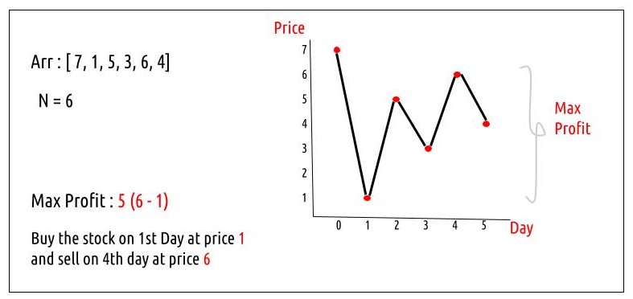

Stock Buy and Sell | (DP-35) :::::: Best time to buy and sell stock

Problem Statement: We are given an array Arr[] of length n. It represents the price of a stock on ‘n’ days. The following guidelines need to be followed:
->We can buy and sell a stock only once.
->We can buy and sell the stock on any day but to sell the stock, we need to first buy it on the same or any previous day.



Intuition: 
We need to find the maximum profit. In order to maximize the profit, we need to buy the stock at its lowest price and sell it when the price is highest. In the given example the lowest price(1) is on Day 1 and the highest price is (7) is on Day 0. But we need to buy the stock before selling it therefore we need to modify this approach.

We can try to sell the stock every day and try to find the maximum profit that can be generated by selling the stock on that day. At last, we can return the maximum of these individual maximum profits as our answer. 

To find the individual maximum profit on a day ‘i’, we know the selling price, i.e the price of the stock on day i, we need to find the buying price. To maximize the profit on day ‘i’, the buying price should be the lowest price of the stock from day 0 to day i (see the graph above). This way we can keep track of the correct buying price for any day.

Approach:
The algorithm approach can be stated as:

Initialize a variable ‘maxProfit’ to 0 and declare another variable ‘mini’ which we will use to keep track of the buying price (minimum price from day 0 to day i) for selling the stock.
Traverse the array from index 1 to n-1. We started at index 1 because buying and selling the stock on the 0th day will give us a profit of 0, which we have initialized our maxProfit as already.
In each iteration, try to find the curProfit. The selling price will be Arr[i] and ‘mini’ will give us the buying price. We calculate the curProfit. If it is more than the existing profit value (maxProfit), we update the maxProfit value.
Before going to the next iteration, we check if the current price (Arr[i]) is less than the mini value, and we assign it as the new mini value. In this way, we keep track of the buying price in a single iteration itself.

### Step 1: Transformed Python Code

Here is the Python version of your Java code for the "Best Time to Buy and Sell Stock" problem:

```python
def maximum_profit(prices):
    max_profit = 0
    mini = prices[0]

    for price in prices[1:]: ##This directly corresponds with how we iterate through prices[1:] to skip the first element (used as mini).
        cur_profit = price - mini
        max_profit = max(max_profit, cur_profit)
        mini = min(mini, price)

    return max_profit

if __name__ == "__main__":
    prices = [7, 1, 5, 3, 6, 4]
    print(f"The maximum profit by selling the stock is {maximum_profit(prices)}")
```

